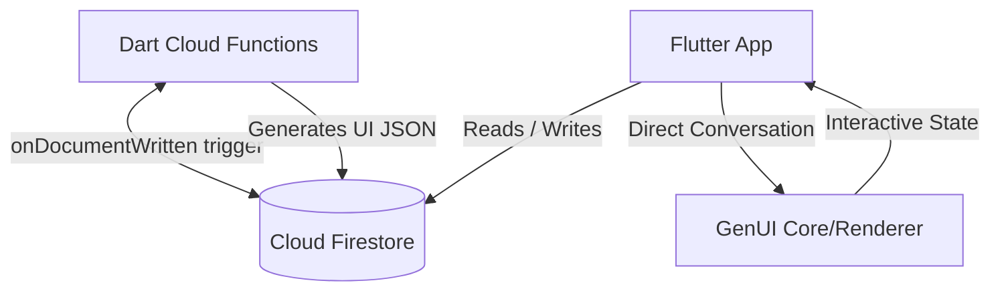

# Commis Catering Assistant

An AI-powered catering assistant showcasing how to build interactive, stateful **Generative UI (GenUI)** utilizing Flutter, Cloud Firestore, and Dart Cloud Functions. 

This repository is organized as a monorepo containing both the mobile/tablet client application and the serverless backend triggers.



---

## Project Structure

This project is divided into two primary workspaces:

1.  **[Flutter Application (app/)](app/README.md)**: The Flutter frontend application displaying upcoming catering jobs, menus, ingredient listings, and hosting the interactive AI Culinary Assistant chat interface.
2.  **[Cloud Functions (functions/)](functions/README.md)**: The serverless backend codebase written in Dart. This includes Firestore triggers that monitor job updates to automatically generate and cache recommended UI cards using Gemini.

Refer to the individual `README.md` files linked above for specific setup and configuration details for each component.

---

## Quick Start (Local Development)

To run the full stack locally using the Firebase Emulator Suite, perform the following steps:

### 1. Prerequisites
- [Flutter SDK](https://docs.flutter.dev/get-started/install)
- [Firebase CLI](https://firebase.google.com/docs/cli) (v15.15.0 or higher is required for Dart support)
- [FlutterFire CLI](https://firebase.google.com/docs/flutter/setup)

### 2. Enable Dart Functions support
```bash
firebase experiments:enable dartfunctions
```

### 3. Start the Emulators
From the root of the workspace, start the Firebase emulator:
```bash
firebase emulators:start
```

### 4. Seed the Database
While the emulator is running, open a new terminal window to seed Firestore with the mock catering dataset:
```bash
export FIRESTORE_EMULATOR_HOST=localhost:8080
cd functions
dart run bin/seed_ingredients.dart
dart run bin/seed_recipes.dart
dart run bin/seed_jobs.dart
```

### 5. Run the Flutter App
From the `app/` directory, configure your local Firebase app and run:
```bash
cd app
flutterfire configure
flutter run
```
*(In debug mode, the app automatically detects and routes traffic to the local Firestore and Functions emulators).*
