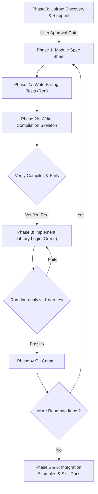

# Multi-Agent TDD Skills for Dart Porting

A suite of [Antigravity](https://antigravity.google) skills designed for porting Python libraries to Dart using a multi-agent Test-Driven Development (TDD) workflow.

This collection provides system prompts, constraints, and orchestration guidelines for a team of specialized AI subagents (Coordinator, Architect, Tester, and Coder) working collaboratively to produce robust, high-quality, and idiomatic Dart packages.

---

## Included Skills

| Skill Name | Role & Objective | Allowed Write Paths |
|---|---|---|
| [`tdd-dart-coordinator`](tdd-dart-coordinator/SKILL.md) | **Orchestrator (Parent Agent)**: Defines subagents, manages TDD handoffs, executes shell verifications (`dart test`), and performs git commits. | Workspace root (Executes commands & commits) |
| [`tdd-dart-architect`](tdd-dart-architect/SKILL.md) | **Lead Architect**: Analyzes the Python source code, writes the architecture blueprint, and authors module specifications. | `<dart_package_dir>/specs/`, `skills/` |
| [`tdd-dart-tester`](tdd-dart-tester/SKILL.md) | **Test Engineer**: Writes failing unit tests using `package:test` based on Architect specs before implementation code is written. | `<dart_package_dir>/test/`, `<dart_package_dir>/example/` |
| [`tdd-dart-coder`](tdd-dart-coder/SKILL.md) | **Software Engineer**: Writes compilation stubs and implements library logic to make failing unit tests pass. | `<dart_package_dir>/lib/`, `<dart_package_dir>/example/` |
| [`tdd-dart-workflow`](tdd-dart-workflow/SKILL.md) | **Workflow Rules & Governance**: Central document outlining roles, strict directory boundaries, git commit policies, and Dart best practices. | Reference / Guidance |

---

## Workflow Overview

The multi-agent TDD porting process follows a structured lifecycle to ensure clean separation of concerns and maintain strict quality gates:

1. **Phase 0: Discovery & Architecture Blueprinting**
   - The Architect analyzes the Python codebase and generates `<dart_package_dir>/specs/architecture_blueprint.md`.
   - **Gate**: The user must explicitly review and approve the architecture blueprint before proceeding.
2. **Phase 1: Module Specification**
   - The Architect writes a spec sheet (`<dart_package_dir>/specs/<module_name>_spec.md`) outlining public APIs, return types, error handling, and test checklists.
3. **Phase 2: Red Phase (Tests & Skeleton)**
   - **Tester** writes unit tests in `test/` (expected to fail compilation initially).
   - **Coder** creates stub implementations in `lib/src/` returning dummy values or throwing `UnimplementedError()`.
   - **Coordinator** verifies tests compile and fail on execution (`UnimplementedError` or assertion failure).
4. **Phase 3: Green Phase (Implementation)**
   - **Coder** implements library logic in `lib/src/` to satisfy all test cases.
   - **Coordinator** verifies passing status via `dart analyze && dart test`.
5. **Phase 4: Commit**
   - **Coordinator** stages and commits the passing module using formatted commit messages.
6. **Phase 5 & 6: Examples & Skill Documentation**
   - Python examples are ported to `<dart_package_dir>/example/` and developer skill docs are written.
